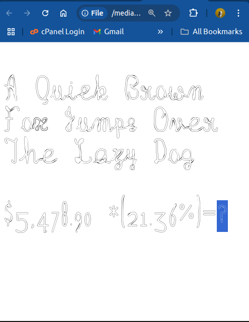

# Rangeen font development
I am documenting creation of a multicolour font using open source tools only. The purpose is getting suggestions of where I am doing wrong or how I can improve it.
### step 1 

Create a skeleton font in Fontforge The font consists of strokes glyphs instead of outline ones.

Initially I have created only the upper case letters and numbers with a few punctuation marks. 


### step 2
Create 4 outline fonts by using Expand stroke feature of Fontforge 


The outlines are varied in thickness and bevel by modifying the stroke parameters. Three layers are created for three colours.


 One level is shifted slightly righwards to create a shadow effect.


The backup layer glyphs are created by applying Expand stroke twice for outline effect.


The fonts are exported in ttf format and are in sources/ttf folder

### step 3
Setup a python venv and install  svg-ot tools and nanoemoj using pip 

```
python3 -m venv venv

source venv/bin/activate

pip install ot-svg

pip install nanoemoji

```

### step 4
Create svg files
```
$ fonts2svg -c 000088,800080,daa520 ttf/rangeen3.ttf ttf/rangeen2.ttf ttf/rangeen1.ttf 
94 SVG files saved.
(ot-svg) artim@ARTIMPOLY:~/devel/rangeen/sources

```
Check the svg files created 


### step 5
Add svg files to Fallback font to create OpenType-SVG font
```
$ addsvg ttf/SVGs ttf/Rangeen.ttf 
94 SVG glyphs were successfully added to Rangeen.ttf
```
### step 6
Create an html file to test the font  

Color Glyphs are displayed in Firefox 


Fallback mechanism also works in Chrome



### step 7

Add COLRv1 files to the font using nanoemoji (fails)

```
ja -C /media/artim/home/@home/artim/devel/rangeen/sources/ttf/build
ninja: Entering directory `/media/artim/home/@home/artim/devel/rangeen/sources/ttf/build'
[194/196] /media/artim/home/@home/arti...utput_file MergeSource.glyf_colr_1.ttf
W1128 13:09:03.149280 135488490209280 glyph_reuse.py:69] affine_between failed: M-24,-246 L-23,-156 L538,-162 L537,-252 Z M156,-15 L70,-15 L70,796 L156,796 Z 
I1128 13:09:03.229546 135488490209280 baseCompiler.py:71] Pre-processing glyphs
I1128 13:09:03.290944 135488490209280 base.py:201] Running DecomposeComponentsFilter on AnEmojiFamily-Regular
I1128 13:09:03.291404 135488490209280 base.py:201] Running CubicToQuadraticFilter on AnEmojiFamily-Regular
I1128 13:09:03.360707 135488490209280 cubicToQuadratic.py:46] New spline lengths: 
I1128 13:09:03.360882 135488490209280 baseCompiler.py:62] Building OpenType tables
I1128 13:09:03.551567 135488490209280 write_font.py:247] Writing MergeSource.glyf_colr_1.ttf
I1128 13:09:03.616381 135488490209280 write_font.py:833] Wrote MergeSource.glyf_colr_1.ttf
[195/196] /media/artim/home/@home/arti...keep_glyph_names.added_glyf_colr_1.ttf
I1128 13:09:04.119690 127514790260736 glue_together.py:223] Wrote Rangeen.keep_glyph_names.added_glyf_colr_1.ttf
[196/196] /media/artim/home/@home/arti...h_names.added_glyf_colr_1.ttf Font.ttf

```

Check tables added to font 
```
 ttx -l Rangeen.keep_glyph_names.added_glyf_colr_1.ttf 
Listing table info for "Rangeen.keep_glyph_names.added_glyf_colr_1.ttf":
    tag     checksum    length    offset
    ----  ----------  --------  --------
    COLR  0x84DFAC8D      5489    131760
    CPAL  0x5CFF28B9        26    137252
    GDEF  0x00290088        34    137280
    OS/2  0x7D9B73B3        96       376
    SVG   0x46000601    254864    137316
    cmap  0xCC91A0D9       322      1988
    gasp  0xFFFF0003         8    131752
    glyf  0xF547F07F    112092      3076
    head  0x28AD5671        54       252
    hhea  0x06AC0369        36       308
    hmtx  0xBCC235B2      1516       472
    loca  0x17CCA9A0       762      2312
    maxp  0x01CB0160        32       344
    name  0x788A2600     13944    115168
    post  0xC17D1128      2639    129112
```


### step 8 
Add CBDT tables to the font 

```
$ maximum_color --bitmaps Rangeen.ttf 
I1128 13:18:13.658456 137917315936256 maximum_color.py:480] Generating build.ninja
I1128 13:18:13.705731 137917315936256 ninja.py:124] ninja -C /media/artim/home/@home/artim/devel/rangeen/sources/ttf/build
ninja: Entering directory `/media/artim/home/@home/artim/devel/rangeen/sources/ttf/build'
[97/99] /media/artim/home/@home/artim/...son --output_file MergeSource.cbdt.ttf
I1128 13:18:14.406694 137505872797696 baseCompiler.py:71] Pre-processing glyphs
I1128 13:18:14.408693 137505872797696 base.py:201] Running DecomposeComponentsFilter on AnEmojiFamily-Regular
I1128 13:18:14.408959 137505872797696 base.py:201] Running CubicToQuadraticFilter on AnEmojiFamily-Regular
I1128 13:18:14.409261 137505872797696 cubicToQuadratic.py:46] New spline lengths: 
I1128 13:18:14.409332 137505872797696 baseCompiler.py:62] Building OpenType tables
I1128 13:18:14.418391 137505872797696 write_font.py:247] Writing MergeSource.cbdt.ttf
I1128 13:18:14.430112 137505872797696 write_font.py:833] Wrote MergeSource.cbdt.ttf
[98/99] /media/artim/home/@home/artim/...f --output_file Rangeen.added_cbdt.ttf
I1128 13:18:14.939719 124869933248512 glue_together.py:223] Wrote Rangeen.added_cbdt.ttf
[99/99] /media/artim/home/@home/artim/...s -v 0 Rangeen.added_cbdt.ttf Font.ttf

```
Check CBDT tables added 

```
$ ttx -l Rangeen.added_cbdt.ttf 
Listing table info for "Rangeen.added_cbdt.ttf":
    tag     checksum    length    offset
    ----  ----------  --------  --------
    CBDT  0xF06D9C4E    557889    131792
    CBLC  0x4FC5F6CB       452    689684
    COLR  0x84DFAC8D      5489    690136
    CPAL  0x5CFF28B9        26    695628
    GDEF  0x00290088        34    695656
    OS/2  0x7D9B73B3        96       408
    SVG   0x46000601    254864    695692
    cmap  0xCC91A0D9       322      2020
    gasp  0xFFFF0003         8    131784
    glyf  0xF547F07F    112092      3108
    head  0x28AD5897        54       284
    hhea  0x06AC0369        36       340
    hmtx  0xBCC235B2      1516       504
    loca  0x17CCA9A0       762      2344
    maxp  0x01CB0160        32       376
    name  0x788A2600     13944    115200
    post  0xC17D1128      2639    129144
```
### Step 9 
View the Font in Font Viewer 


### Step 10 
Create Gradient Font in FontPainter

Open site [FontPainter](https://simoncozens.github.io/fontpainter/)

Load base font (rangeen2.ttf) 


Adjust color and gradient, copy and paste to all glyphs, or adjust individually in each glyph

Save font 

### Step 11
using round tripping through ttx tool, remove SVG tables from CBDT and CPAL/COLR fonts 

### Step 12 
Compress font to woff2 format for use as web font 


